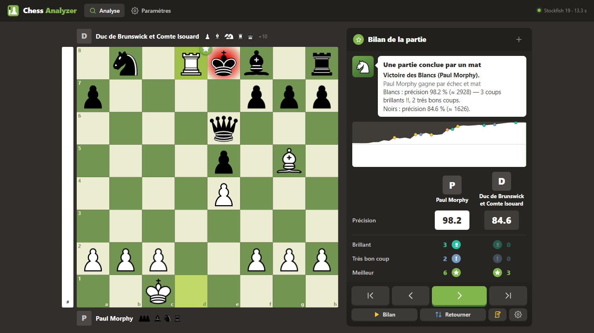
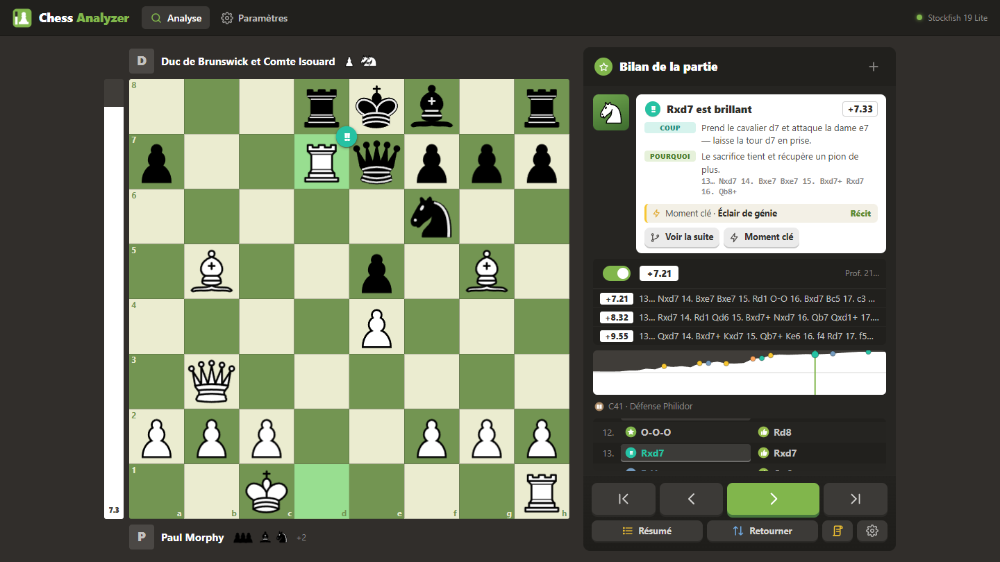
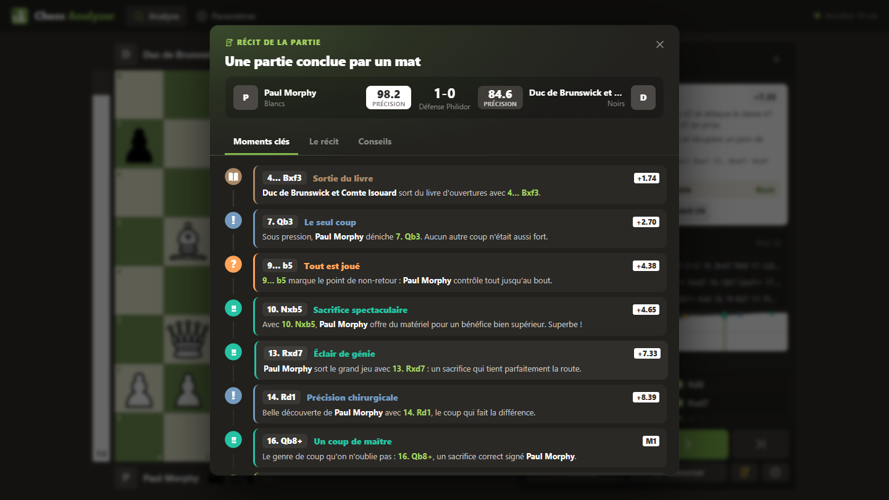

# Chess Analyzer — Stockfish

Extension de navigateur (Chrome, Opera, Opera GX, Edge, Brave) qui remplace le **Bilan de la partie** de chess.com par une analyse locale avec **Stockfish 19**, dans le style de chess.com.

Tout tourne dans le navigateur : rien à installer d'autre, aucun serveur.

| Le coach explique chaque coup | Le récit de la partie |
|---|---|
|  |  |

## Fonctionnalités

- **Bilan de partie** au clic sur « Bilan de la partie / Game Review » ou « Analyse » sur chess.com.
  - Coups classés : Brillant, Très bon coup, Meilleur, Excellent, Bon, Théorique, Forcé, Imprécision, Erreur, Occasion manquée, Gaffe. Une gaffe ne compte que s'il y a perte de matériel ou mat.
  - Précision, performance estimée, notes par phase, graphique d'évaluation, barre d'évaluation, pendules.
- **Coach** qui explique chaque coup :
  - motifs tactiques (fourchettes, clouages, enfilades, échecs à la découverte, menaces de mat, pièces en prise…) ;
  - ce que permettait l'erreur, le meilleur coup et pourquoi, avec la suite de Stockfish ;
  - boutons « Réessayer » et « Meilleur coup ».
- **Récit de la partie**, sans IA :
  - moments clés en chronologie ;
  - chapitres (ouverture, tournant, finale, gestion du temps…) ;
  - conseils personnalisés.
- **Analyse en direct** sur plusieurs lignes, variantes libres, flèches au clic droit.
- **Chargement de parties** : lien chess.com, PGN, FEN, vos dernières parties chess.com, analyses récentes en cache.
- **Nombreux paramètres** : moteur, profondeur, nombre de moteurs en parallèle, sévérité, thèmes d'échiquier, pièces, sons…

## Installation

1. Télécharger le dépôt (bouton **Code → Download ZIP**) et le décompresser.
2. Ouvrir la page des extensions : `chrome://extensions`, `opera://extensions` ou `edge://extensions`.
3. Activer le **Mode développeur**.
4. Cliquer sur **Charger l'extension non empaquetée** et choisir le dossier du projet.

Astuce : **Alt + clic** sur « Bilan de la partie » ouvre l'analyse normale de chess.com.

### Moteur complet (optionnel)

Par défaut, l'extension utilise Stockfish 19 **Lite** (1,7 Mo), largement suffisant. Pour la version complète (NNUE de 99 Mo, plus forte) :

1. Télécharger `stockfish-19-single.js` et `stockfish-19-single.wasm` depuis les [releases de stockfish.js](https://github.com/nmrugg/stockfish.js/releases).
2. Les placer dans le dossier `engine/`.

L'option apparaît alors dans les paramètres.

## Crédits et licences

- [Stockfish](https://stockfishchess.org) / [stockfish.js](https://github.com/nmrugg/stockfish.js) — GPLv3. Ce projet est donc distribué sous **GPLv3** (voir `LICENSE`).
- [chess.js](https://github.com/jhlywa/chess.js) — BSD-2.
- Base d'ouvertures : [lichess-org/chess-openings](https://github.com/lichess-org/chess-openings) (CC0).
- Pièces : jeux cburnett, merida, maestro et alpha de [Lichess](https://github.com/lichess-org/lila).

Extension non officielle, sans lien avec Chess.com.
